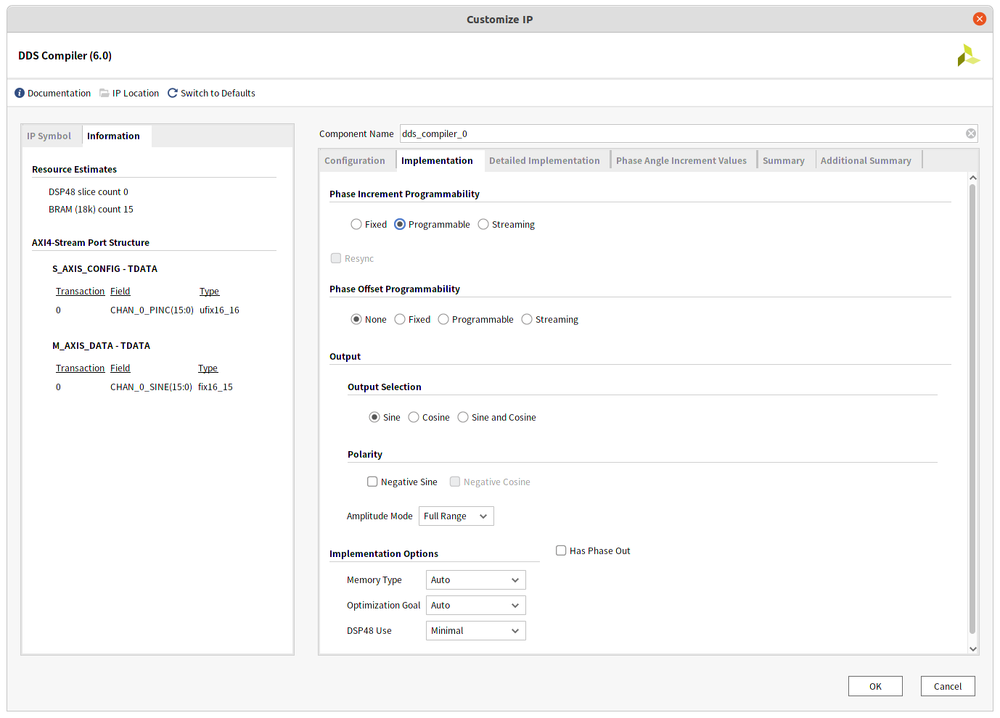
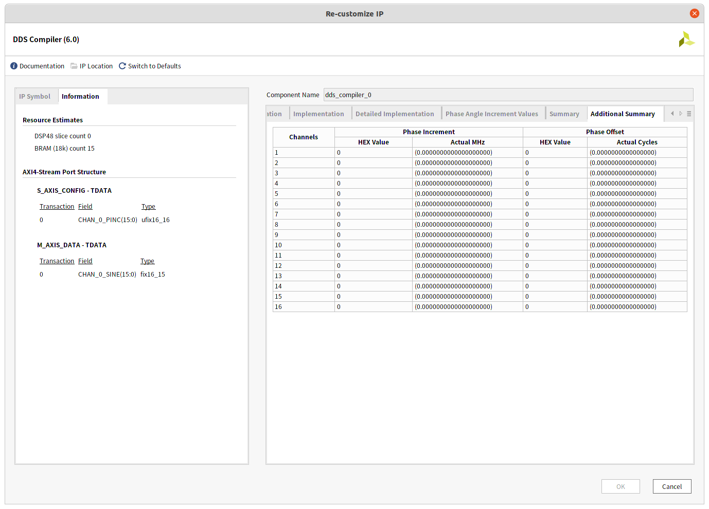

# DDS Programmable Settings

## 설정 스크린샷

1. 


2. 




3. 


4. 


5.


6.




## 테스트 벤치

```verilog
`timescale 1ns / 1ps

module tb_dds_programmable_set();

reg aclk;
reg aresetn;
reg s_axis_config_tvalid;
reg [15 : 0] s_axis_config_tdata;
wire m_axis_data_tvalid;
wire [15 : 0] m_axis_data_tdata;


initial begin
    aresetn = 1;
    s_axis_config_tvalid = 0;
    s_axis_config_tdata = 0;
    @(posedge aclk);
    aresetn = 0;
    @(posedge aclk);
    aresetn = 1;    
end

// Clock generation
initial begin
    aclk = 0;
    forever # 6.25 aclk = ~aclk; // 100 MHz clock
end


initial begin
    #100;
    @(posedge aclk);
    s_axis_config_tvalid = 1;
    s_axis_config_tdata = 16'd819;//(1000000 * pow(2,16))/80000000 = 1Mhz Freq out    
    #3000;
    @(posedge aclk);
    s_axis_config_tvalid = 0;
    @(posedge aclk);
    s_axis_config_tvalid = 1;
    s_axis_config_tdata = 16'd12288;//(15000000 * pow(2,16))/80000000 = 15Mhz Freq out
    #2000;
    @(posedge aclk);
    s_axis_config_tvalid = 0;
    @(posedge aclk);
    s_axis_config_tvalid = 1;
    s_axis_config_tdata = 16'd24576;//(30000000 * pow(2,16))/80000000 = 30Mhz Freq out    
    #1000;
    @(posedge aclk);
    s_axis_config_tvalid = 0;
    $finish;
end


dds_compiler_0 tb_dds_programmable_set (
  .aclk(aclk),                                  // input wire aclk
  .aresetn(aresetn),                            // input wire aresetn
  .s_axis_config_tvalid(s_axis_config_tvalid),  // input wire s_axis_config_tvalid
  .s_axis_config_tdata(s_axis_config_tdata),    // input wire [15 : 0] s_axis_config_tdata
  .m_axis_data_tvalid(m_axis_data_tvalid),      // output wire m_axis_data_tvalid
  .m_axis_data_tdata(m_axis_data_tdata)        // output wire [15 : 0] m_axis_data_tdata
);
endmodule

```


## 시뮬레이션


## 프로젝트 생성

현재 폴더 위치(~/XilinxIpCoreTutorial/DDS/ProgrammableSet)에서 아래 명령을 수행하면 project_DDS_ProgrammableSet 폴더가 생성된다. 단 비바도 버전에 따라 생성되지 않을수도 있다. 현재 비바도 버전은 2020.2이다. 

### 실행 명령

```bash
~/XilinxIpCoreTutorial/DDS/ProgrammableSet$ ./create_project.sh 
```


### 명령 수행 결과


