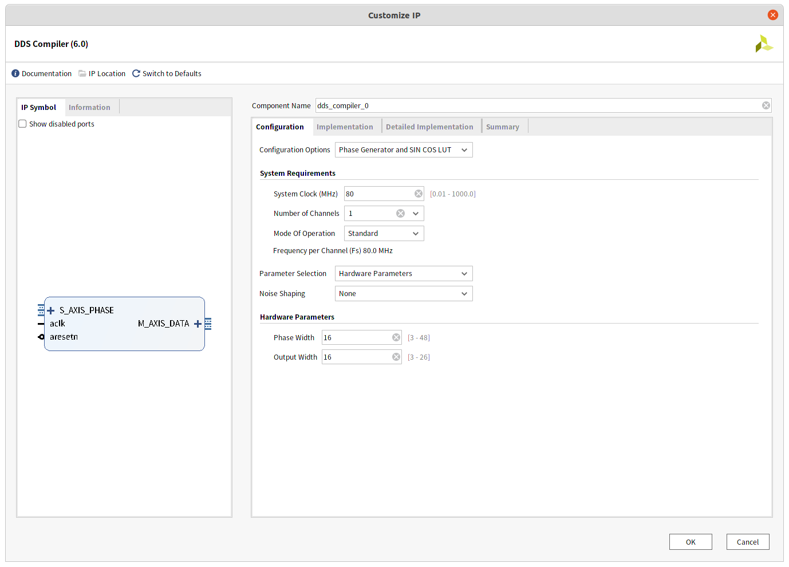
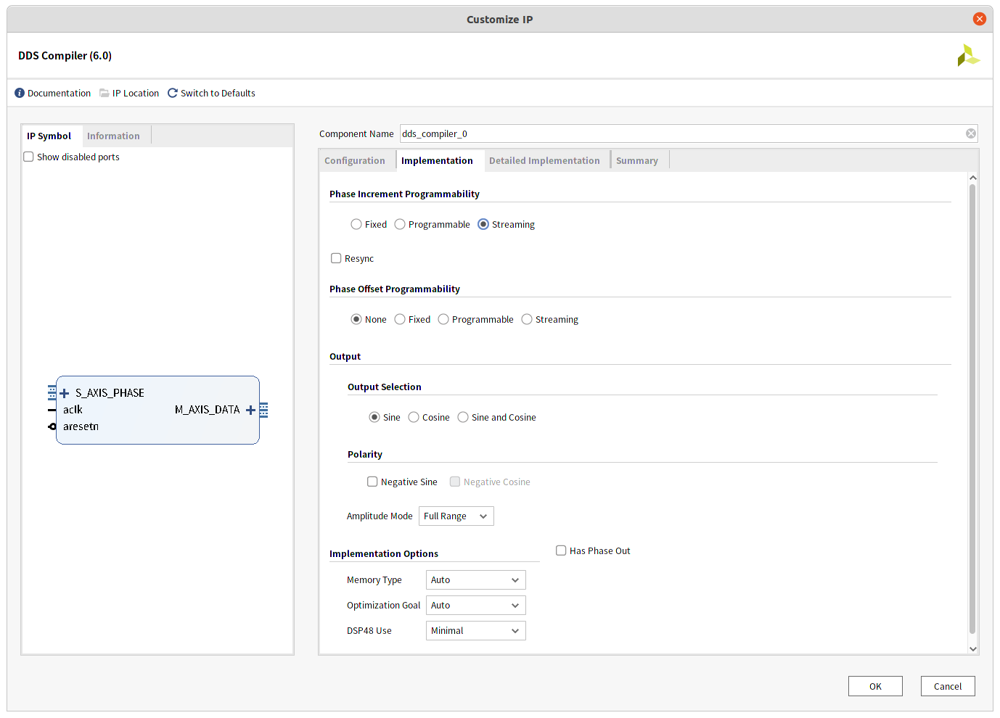
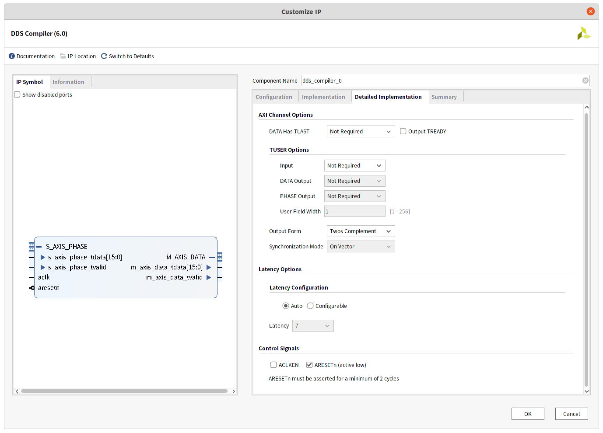
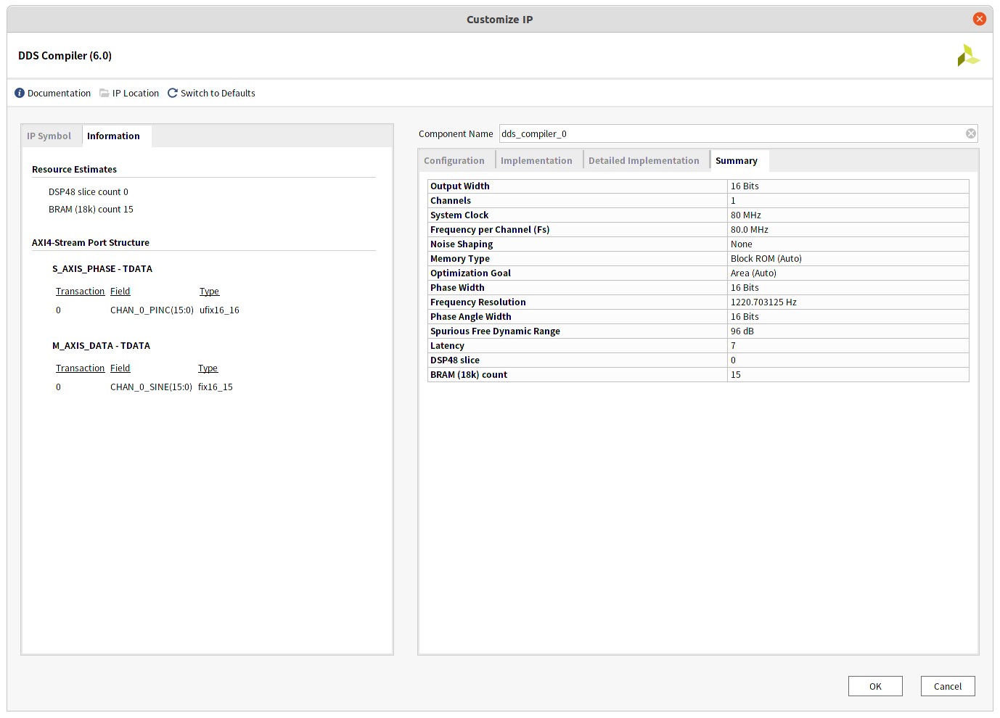
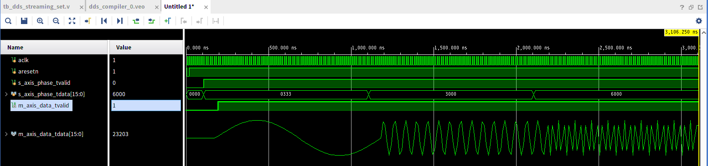
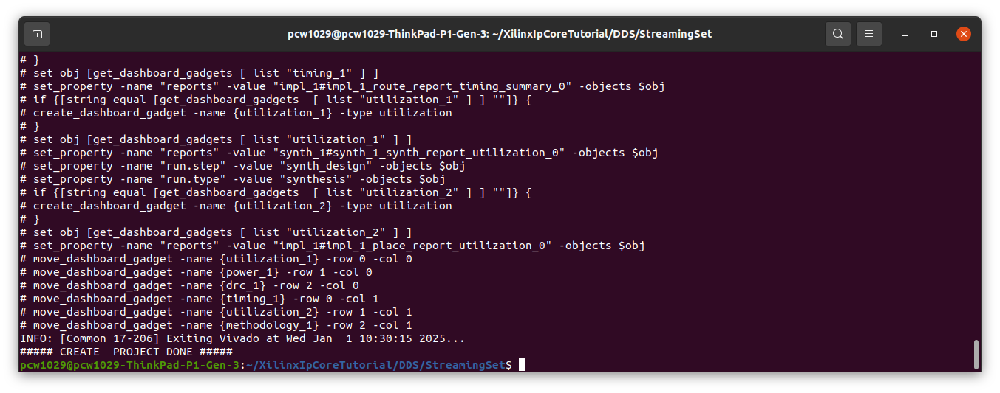

# DDS Streaming Settings

## 설정 스크린샷

1. 




2. 




3. 




4. 




## 테스트 벤치

```verilog
`timescale 1ns / 1ps

module tb_dds_streaming_set();

reg aclk;
reg aresetn;
reg s_axis_phase_tvalid;
reg [15 : 0] s_axis_phase_tdata;
wire m_axis_data_tvalid;
wire [15 : 0] m_axis_data_tdata;

// 신호 초기화 및 출력 파일 열기
initial begin
    aresetn = 1;
    s_axis_phase_tvalid = 0;
    s_axis_phase_tdata = 0;
    
    @(posedge aclk);
    aresetn = 0; // 리셋 신호 활성화
    @(posedge aclk);
    aresetn = 1; // 리셋 신호 비활성화
end

// 클록 생성: 100 MHz 클록
initial begin
    aclk = 0;
    forever #6.25 aclk = ~aclk; // 6.25ns마다 클록 토글
end

// 설정 신호 생성 및 데이터 수집 완료 대기
initial begin
    #100; // 초기 지연
    @(posedge aclk);
    s_axis_phase_tvalid = 1;
    s_axis_phase_tdata = 16'd819; // 1 MHz 출력 주파수 설정
    #1000;
    @(posedge aclk);
    s_axis_phase_tdata = 16'd12288; // 15 MHz 출력 주파수 설정
    #1000;
    @(posedge aclk);
    s_axis_phase_tdata = 16'd24576; // 30 MHz 출력 주파수 설정
    #1000;
    @(posedge aclk);
    s_axis_phase_tvalid = 0; // 유효 신호 비활성화
    #10;    
    $finish; // 시뮬레이션 종료
end


// DDS Compiler 모듈 인스턴스화
dds_compiler_0 tb_dds_streaming_set (
  .aclk(aclk),                                  // input wire aclk
  .aresetn(aresetn),                            // input wire aresetn
  .s_axis_phase_tvalid(s_axis_phase_tvalid),  // input wire s_axis_phase_tvalid
  .s_axis_phase_tdata(s_axis_phase_tdata),    // input wire [15 : 0] s_axis_phase_tdata
  .m_axis_data_tvalid(m_axis_data_tvalid),      // output wire m_axis_data_tvalid
  .m_axis_data_tdata(m_axis_data_tdata)         // output wire [15 : 0] m_axis_data_tdata
);

endmodule


```


## 시뮬레이션




## 프로젝트 생성

현재 폴더 위치(~/XilinxIpCoreTutorial/DDS/ProgrammableSet)에서 아래 명령을 수행하면 project_DDS_ProgrammableSet 폴더가 생성된다. 단 비바도 버전에 따라 생성되지 않을수도 있다. 현재 비바도 버전은 2020.2이다. 

### 실행 명령

```bash
~/XilinxIpCoreTutorial/DDS/StreamingSet$ ./create_project.sh 
```


### 명령 수행 결과


